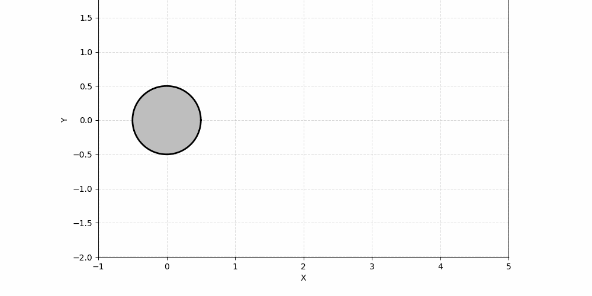
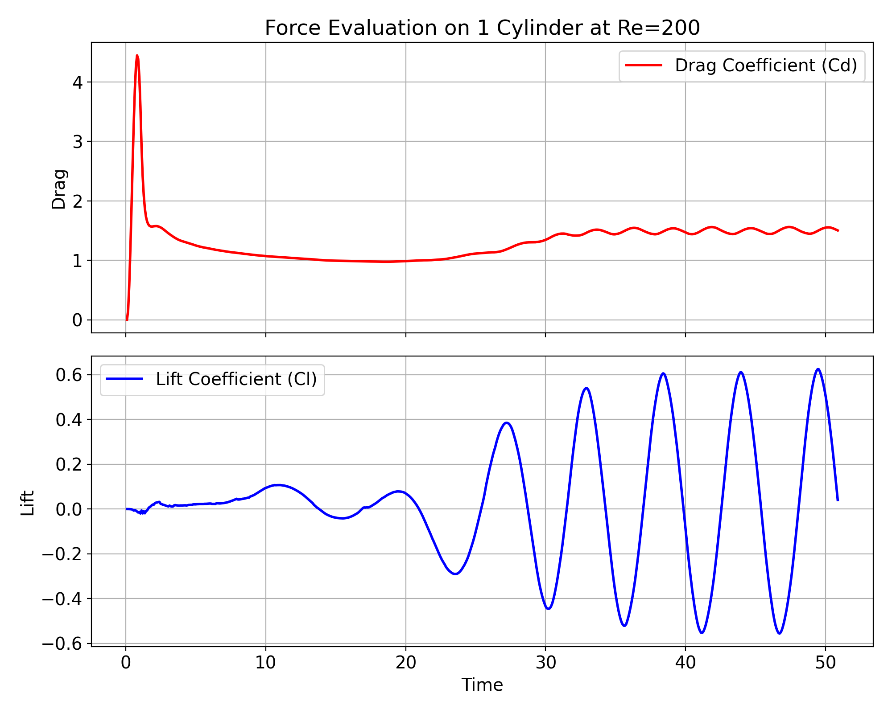

# pyVPM

A Python implementation of the **Vortex Particle Method (VPM)** for 2D viscous flow simulation. pyVPM simulates the unsteady, incompressible flow around immersed bodies and computes aerodynamic forces (lift and drag) using a Lagrangian vortex particle approach.



## Features

- **Lagrangian vortex particle convection** via the Biot-Savart law with blob regularization
- **Fast Multipole Method (FMM)** treecode for O(N log N) velocity evaluation at large particle counts
- **Viscous diffusion** through particle-to-mesh redistribution and remeshing
- **Boundary condition enforcement** with panel-based vorticity shedding (no-slip)
- **Aerodynamic force computation** using both viscous and unsteady pressure components
- **VTK output** for visualization in [ParaView](https://www.paraview.org/)
- **PVD / JSON time-series** export for convenient ParaView time animation

## Example: Flow Around a Cylinder at Re = 200



```python
from pyVPM.solver import VPMSolver

solver = VPMSolver(dt=0.08, t_max=1.6, reynolds=200, dx=0.01)
solver.add_body("Dom1.dat")
solver.run()
```

Results are written to `results_py/` as per-step VTK files (`step_0000.vtk`, …) and a
`Forces.dat` file containing time-series lift and drag data.

## Installation

### Prerequisites

- Python 3.8+
- [NumPy](https://numpy.org/)
- [Numba](https://numba.readthedocs.io/)
- [Matplotlib](https://matplotlib.org/)

Install the dependencies with pip:

```bash
pip install numpy numba matplotlib
```

### Clone the repository

```bash
git clone https://github.com/ogiannopoulou/pyVPM.git
cd pyVPM
```

## Usage

### Running a simulation

```python
from pyVPM.solver import VPMSolver

# Create a solver for flow at Re=200
solver = VPMSolver(
    dt=0.08,          # convection time step
    t_max=1.6,        # total simulation time
    reynolds=200,     # Reynolds number
    dx=0.01,          # diffusion mesh spacing
    output_dir="results_py"
)

# Load a body geometry from a .dat file
solver.add_body("Dom1.dat")

# Run the full simulation
solver.run()
```

### Step-by-step control

```python
solver = VPMSolver(dt=0.08, t_max=1.6, reynolds=200, dx=0.01)
solver.add_body("Dom1.dat")

for i in range(20):
    solver.step()
    print(f"Time: {solver.time:.3f}, Particles: {len(solver.x)}")
    solver.save_vtk(i)
```

### Generating ParaView time-series files

After a simulation has finished, create a `.pvd` collection and a `.vtk.series` JSON
file so that ParaView can animate all time steps at once:

```python
from pyVPM.create_pvd_results import create_pvd_and_series

create_pvd_and_series(directory="results_py", output_name="simulation_results")
```

### Body geometry format

Bodies are defined in Fortran-style `.dat` files. The file must contain the keyword
`nCpoints_of_Chunk_1` followed by the number of boundary points, then the x/y
coordinates of those points (one pair per line):

```
100  nCpoints_of_Chunk_1
0.500000  0.000000
0.490393  0.098017
...
```

## Project Structure

```
pyVPM/
├── pyVPM/
│   ├── __init__.py
│   ├── solver.py           # VPMSolver — top-level simulation driver
│   ├── body.py             # Body — geometry loading, BEM, vorticity shedding, forces
│   ├── domain.py           # Domain / Mesh — diffusion parameters and mesh management
│   ├── diffusion.py        # Particle-to-mesh redistribution (Numba JIT)
│   ├── fmm.py              # Fast Multipole Method velocity evaluation (Numba JIT)
│   ├── velocity.py         # Direct Biot-Savart kernel (Numba JIT, parallel)
│   ├── panels.py           # QuadTree / Panel — FMM tree construction
│   └── create_pvd_results.py  # ParaView PVD / JSON series export utility
├── Dom1.dat                # Example cylinder geometry
├── lift_drag_1cylinder_re200.png
├── vorticity_animation_vpm.gif
└── README.md
```

## Algorithm Overview

1. **Vorticity shedding** — At each time step the no-slip condition is enforced along
   body panels. The tangential slip velocity is computed from the freestream plus the
   Biot-Savart-induced velocity of all existing particles at the panel midpoints.
   Compensating vortex particles are emitted just outside the body surface.

2. **Convection** — Particle velocities are evaluated with the regularized Biot-Savart
   law. For fewer than ~100 particles a direct O(N²) kernel is used; above that
   threshold the FMM treecode reduces the cost to approximately O(N log N).

3. **Diffusion** — Every `cdt` convection steps, particles are projected onto a
   background Cartesian mesh using a Gaussian weighting kernel. New particles are then
   re-sampled from mesh nodes whose circulation exceeds a threshold, implementing the
   Particle Strength Exchange (PSE) / remeshing scheme.

4. **Force evaluation** — Drag and lift are decomposed into a viscous component
   (tangential vorticity integral along the body) and an unsteady pressure component
   (via the unsteady Bernoulli equation integrated around the body contour).

5. **Output** — Particle positions and circulation strengths are written as ASCII VTK
   unstructured-grid files at regular intervals, and aerodynamic forces are appended to
   `Forces.dat`.

## Output Files

| File | Description |
|------|-------------|
| `results_py/step_NNNN.vtk` | Per-step particle data (position + circulation) in VTK format |
| `results_py/Forces.dat` | Time-series columns: `Time  Drag_p  Lift_p  Drag_v  Lift_v  Drag_tot  Lift_tot` |
| `results_py/simulation_results.pvd` | ParaView collection file (generated by `create_pvd_results`) |
| `results_py/simulation_results.vtk.series` | ParaView JSON series file |

## License

This project does not currently include a license file. Please contact the author for
usage terms.
